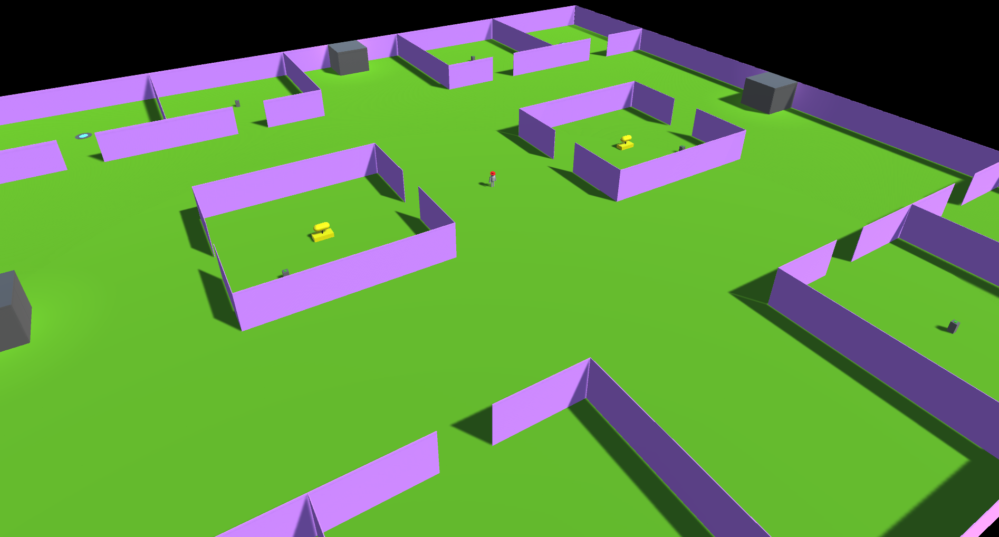

The purpose of this technical demo is to show one method of how to make a **basic** MMO. Including a chat system, player persistence, multiple flowing ColyseusRooms and networked interactable objects. It is important to note that this demo **does not** include sharding or any other methods of load balancing that one would need for a production scale MMO. This demo is designed to work with Colyseus version 0.14.7 and [Unity version 2020.3.1f1](https://unity3d.com/unity/qa/lts-releases).

Please check our [documentation](https://docs.colyseus.io/demo/mmo/) for more information about utilizing this demo

